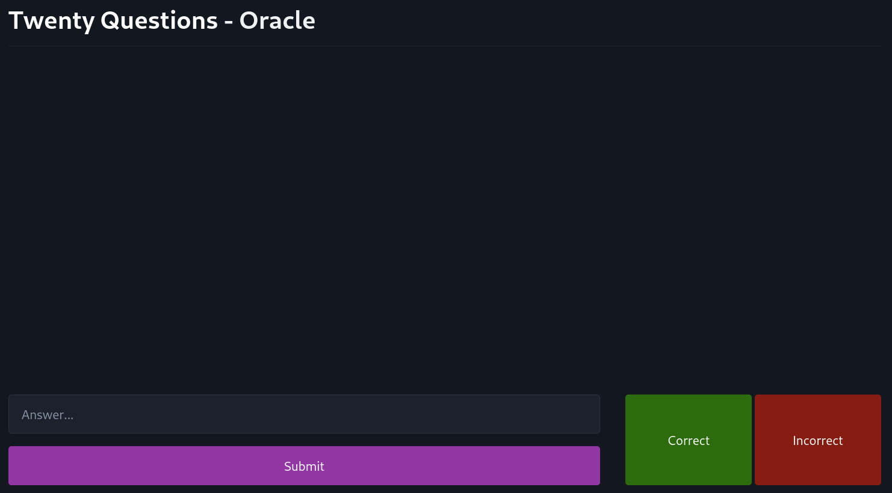

# Twenty Questions

## [Try the game here](htttps://https://www.twentyquestions.hmcalister.nz/)

An implementation of Twenty Questions, a guessing game based around asking questions to an oracle to identify an object or concept.

When a new game is created, the creator becomes the oracle. Guessers can join the game by connecting to the same game URL. This implementation allows for multiple games to occur simultaneously, with each game being handled by a separate subrouter. Games are removed after 24 hours. The oracle is authenticated using a JWT based on the game ID, so no other players can connect to the oracle URL and steal the game.